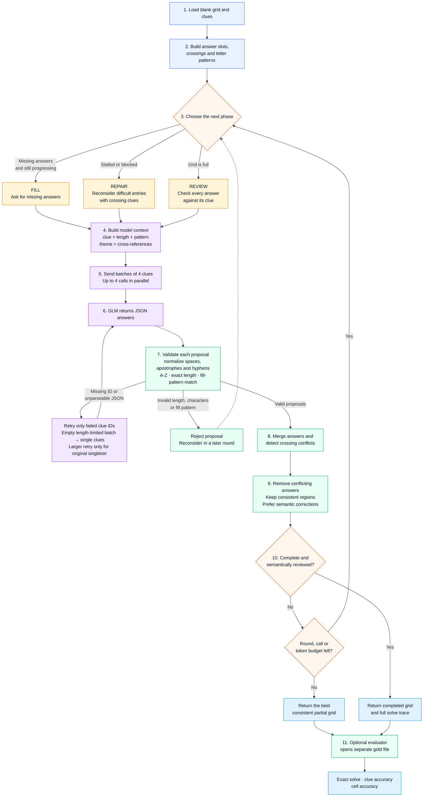
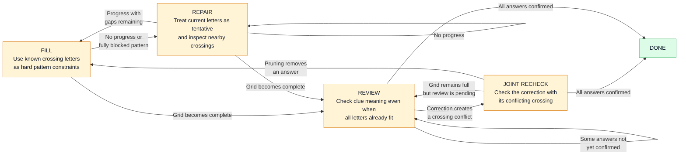
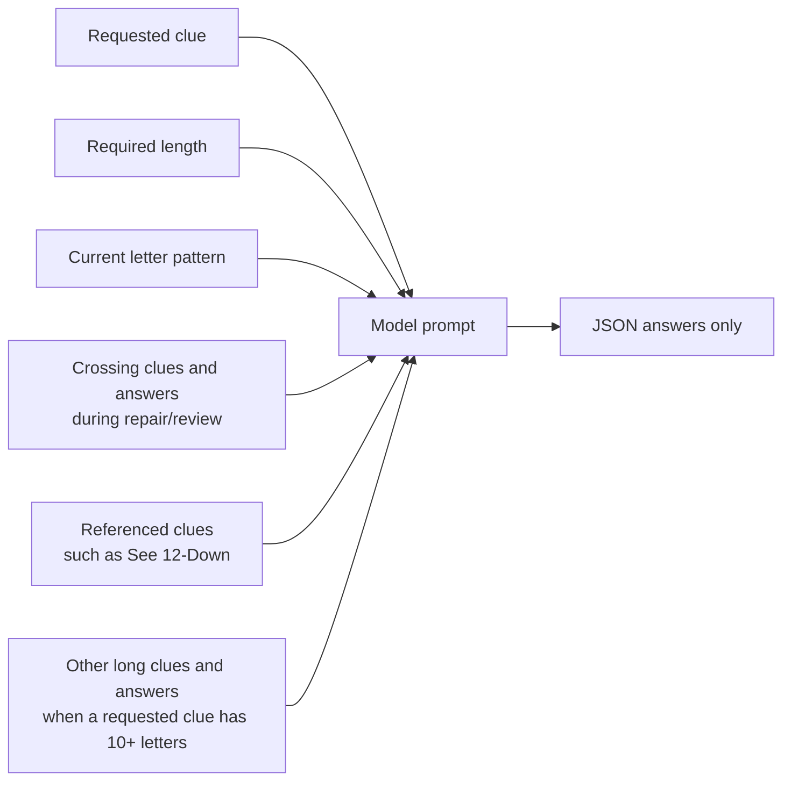
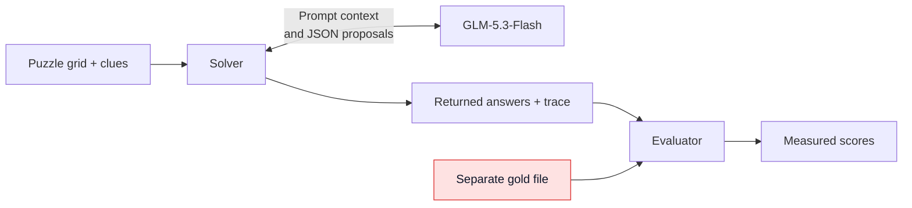

# How the AI Agent Solves a Crossword

The model proposes answers. Python controls the solve, checks every proposal and decides what the model should reconsider.

## Complete solving flow

## What happens inside each phase

### Fill

- Requests only unanswered clues.
- Uses existing crossing letters as required pattern letters.
- Rejects wrong lengths, invalid characters and pattern violations.

### Repair

- Activates when progress stops or a fully determined pattern is rejected.
- Sends difficult missing entries together with their crossing clues.
- Treats existing letters as tentative so an earlier wrong answer can be replaced.
- Jointly rechecks a semantic correction and any answer that conflicts with it.
- Returns to fill after making progress with gaps remaining; stays in repair after no progress.

### Review

- Runs after the grid has an answer for every clue.
- Asks the model to confirm clue meaning instead of trusting crossings alone.
- Prevents a rejected answer from immediately returning through fill mode.
- Immediately rechecks a semantic correction with any conflicting crossing answer.
- If pruning removes an answer, the next round fills the resulting gap.

### Retry and budget control

- Immediately retries missing IDs and responses that cannot be parsed.
- Rejects invalid characters, lengths and fill-pattern violations; the next round can reconsider those clues.
- Retries an empty length-limited batch directly as individual clues instead of recursively creating intermediate batches.
- Does not give a split-generated singleton another 12,000-token attempt.
- Preserves one larger retry for a request that started as a singleton.
- Records each returned response, final error and provider usage report in the solve trace.
- Summarizes transient HTTP retries with `http_attempts` rather than storing each intermediate HTTP error.

## Prompt context sent to the model

The model never receives the gold solution. Gold remains outside the solving loop and is opened only after `solve()` returns.

## Gold boundary

## Code responsibilities

| Component | File | Responsibility |
|---|---|---|
| Puzzle | `src/puzzle.py` | Load and validate the grid; build slots, patterns and crossings |
| Model client | `src/llm_client.py` | Call Nebius Token Factory; enforce call/token budgets and HTTP retries |
| Solver | `src/solver.py` | Run fill, repair, review, validation, pruning and tracing |
| Evaluator | `src/evaluator.py` | Compare returned answers with gold after inference |
| Demo | `app.py` | Show live solving or replay a recorded run |
| CLI | `run_eval.py` | Run one puzzle, optionally evaluate it and save the full result |

The reported app and CLI configuration uses 12 rounds, up to 200 HTTP attempts and a 400,000 reported-token threshold per puzzle. The round limit is configurable up to 30, and concurrent in-flight requests can take reported usage slightly above the token threshold. The controller uses no answer retrieval, candidate beam or constraint-satisfaction solver. A structurally complete grid can still be semantically wrong, so only the separate evaluator can establish an exact solve.
